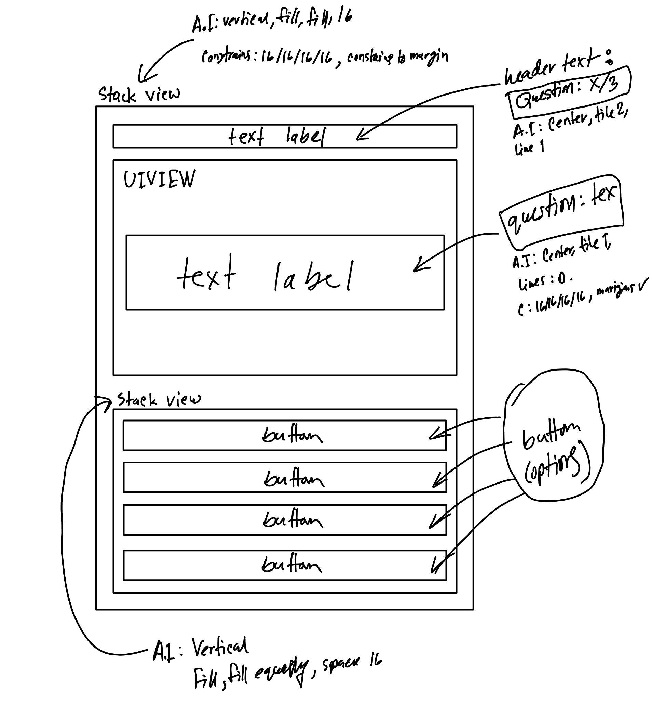

# Project 3 - *Trivia*

Submitted by: **Mohammed Abdur Rahman**

**Trivia** is an app that lets you answer fun multiple-choice questions one by one, showing your score at the end and allowing you to restart the fun game!

Time spent: **7** hours spent in total

## Required Features

The following **required** functionality is completed:

- [x] User can view the current question and 4 different answers
- [x] User can view the next question after tapping an answer
- [x] User can answer at least 3 different questions

The following **optional** features are implemented:

- [x] User should be able to restart the game after they've finished answering all questions

## Video Walkthrough

    
    

## Notes

Designing the UI was the hardest part of the project because of contraints and finding different options within Xcode.

## UI Structure

## License

    Copyright [2025] [Mohammed Abdur Rahman]

    Licensed under the Apache License, Version 2.0 (the "License");
    you may not use this file except in compliance with the License.
    You may obtain a copy of the License at

        http://www.apache.org/licenses/LICENSE-2.0

    Unless required by applicable law or agreed to in writing, software
    distributed under the License is distributed on an "AS IS" BASIS,
    WITHOUT WARRANTIES OR CONDITIONS OF ANY KIND, either express or implied.
    See the License for the specific language governing permissions and
    limitations under the License.